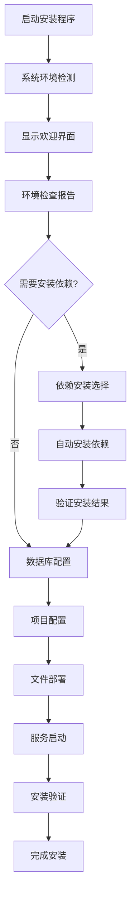

# 跨平台Web安装向导系统设计方案

## 📋 目录

- [概述](#概述)
- [技术架构](#技术架构)
- [安装流程设计](#安装流程设计)
- [核心模块设计](#核心模块设计)
- [用户界面设计](#用户界面设计)
- [平台兼容性](#平台兼容性)
- [实现方案](#实现方案)
- [部署策略](#部署策略)

---

## 🎯 概述

### 设计目标

构建一个跨平台的Web安装向导，能够：
- 🌐 **跨平台支持**：Linux、Windows、macOS
- 🔍 **智能检测**：自动检测系统环境和依赖
- 📦 **自动安装**：自动下载和安装缺失的依赖
- 🎨 **友好界面**：提供直观的Web界面指导
- ⚡ **一键部署**：简化整个安装过程

### 核心功能

- ✅ 系统环境检测（OS、架构、权限）
- ✅ 依赖软件检测和安装（Node.js、Go、数据库）
- ✅ 数据库配置和初始化（MySQL、MongoDB）
- ✅ 项目文件部署和配置
- ✅ 服务启动和验证
- ✅ 安装后配置和优化

---

## 🏗️ 技术架构

### 整体架构图

```
┌─────────────────────────────────────────────────────────┐
│                   安装向导程序                          │
├─────────────────────────────────────────────────────────┤
│  ┌─────────────┐  ┌─────────────┐  ┌─────────────┐      │
│  │  Web界面    │  │  Go后端     │  │  系统调用   │      │
│  │             │  │             │  │             │      │
│  │ Vue.js      │◄─┤HTTP Server  │◄─┤System Utils │      │
│  │ Element Plus│  │Gin Framework│  │Package Mgr  │      │
│  │ 嵌入式资源  │  │Installation │  │File Ops     │      │
│  └─────────────┘  └─────────────┘  └─────────────┘      │
└─────────────────────────────────────────────────────────┘
```

### 技术栈选择

#### 后端核心
- **Go 1.21+**：跨平台编译、高性能、丰富的系统API
- **Gin Framework**：轻量级HTTP服务器
- **embed**：嵌入静态资源

#### 前端界面
- **Vue 3**：响应式用户界面
- **Element Plus**：UI组件库
- **Vite**：前端构建工具

#### 系统集成
- **Package Managers**：各平台包管理器集成
- **Database Drivers**：MySQL、MongoDB连接器
- **System APIs**：文件系统、进程管理、网络检测

---

## 🔄 安装流程设计

### 主要安装步骤



### 详细流程说明

#### 1. 预检查阶段 (Pre-Check)
```
检测项目：
├── 操作系统类型和版本
├── 系统架构 (x64, arm64)
├── 可用磁盘空间
├── 网络连接状态
├── 管理员权限
└── 端口占用情况 (8080, 3306, 27017)
```

#### 2. 依赖检测阶段 (Dependencies)
```
必需依赖：
├── Node.js (>= 18.0)
├── npm/yarn
├── Go (>= 1.21)
├── Git
└── 数据库服务
    ├── MySQL (>= 8.0)
    └── MongoDB (>= 6.0)
```

#### 3. 自动安装阶段 (Auto-Install)
```
安装策略：
├── Windows: Chocolatey/Scoop/直接下载
├── macOS: Homebrew/直接下载
├── Linux: apt/yum/dnf/snap/直接下载
└── 备用方案: 官方下载源
```

#### 4. 配置阶段 (Configuration)
```
配置项目：
├── 数据库连接配置
├── 应用端口配置
├── 安全密钥生成
├── 环境变量设置
└── 服务配置文件
```

---

## 🧩 核心模块设计

### 1. 系统检测模块

```go
package detector

type SystemInfo struct {
    OS           string `json:"os"`
    Arch         string `json:"arch"`
    Version      string `json:"version"`
    FreeSpace    int64  `json:"free_space"`
    HasAdminPerm bool   `json:"has_admin_perm"`
    NetworkOK    bool   `json:"network_ok"`
}

type DependencyStatus struct {
    Name      string `json:"name"`
    Required  string `json:"required"`
    Current   string `json:"current"`
    Installed bool   `json:"installed"`
    Available bool   `json:"available"`
}

type Detector interface {
    DetectSystem() (*SystemInfo, error)
    CheckDependencies() ([]DependencyStatus, error)
    CheckPorts(ports []int) map[int]bool
}
```

### 2. 包管理模块

```go
package installer

type PackageManager interface {
    Install(pkg string) error
    IsInstalled(pkg string) bool
    GetVersion(pkg string) string
    Update(pkg string) error
}

type WindowsPackageManager struct {
    UseChocolatey bool
    UseScoop      bool
}

type MacOSPackageManager struct {
    UseHomebrew bool
}

type LinuxPackageManager struct {
    PackageManager string // apt, yum, dnf, etc.
}
```

### 3. 数据库配置模块

```go
package database

type DatabaseConfig struct {
    Type     string `json:"type"`
    Host     string `json:"host"`
    Port     int    `json:"port"`
    Username string `json:"username"`
    Password string `json:"password"`
    Database string `json:"database"`
}

type DatabaseManager interface {
    TestConnection(config DatabaseConfig) error
    CreateDatabase(config DatabaseConfig) error
    InitializeTables(config DatabaseConfig) error
    CreateUser(config DatabaseConfig) error
}
```

### 4. 项目部署模块

```go
package deployer

type DeploymentConfig struct {
    ProjectPath   string `json:"project_path"`
    ServicePort   int    `json:"service_port"`
    DatabaseURL   string `json:"database_url"`
    SecretKey     string `json:"secret_key"`
    LogLevel      string `json:"log_level"`
}

type Deployer interface {
    ExtractFiles(targetPath string) error
    GenerateConfig(config DeploymentConfig) error
    BuildProject() error
    StartServices() error
    VerifyInstallation() error
}
```

---

## 🎨 用户界面设计

### 主要界面布局

#### 1. 欢迎页面
```vue
<template>
  <div class="welcome-page">
    <div class="hero-section">
      <h1>插件系统安装向导</h1>
      <p>欢迎使用跨平台插件系统安装程序</p>
      <el-button type="primary" size="large" @click="startInstall">
        开始安装
      </el-button>
    </div>
    
    <div class="system-info">
      <el-descriptions title="系统信息" :column="2">
        <el-descriptions-item label="操作系统">{{ systemInfo.os }}</el-descriptions-item>
        <el-descriptions-item label="架构">{{ systemInfo.arch }}</el-descriptions-item>
        <el-descriptions-item label="可用空间">{{ systemInfo.freeSpace }}</el-descriptions-item>
      </el-descriptions>
    </div>
  </div>
</template>
```

#### 2. 依赖检查页面
```vue
<template>
  <div class="dependency-check">
    <h2>环境依赖检查</h2>
    
    <el-table :data="dependencies" style="width: 100%">
      <el-table-column prop="name" label="依赖名称" width="200">
        <template #default="scope">
          <el-icon><Box /></el-icon>
          {{ scope.row.name }}
        </template>
      </el-table-column>
      
      <el-table-column prop="required" label="要求版本" width="120" />
      
      <el-table-column prop="current" label="当前版本" width="120">
        <template #default="scope">
          <span v-if="scope.row.installed">{{ scope.row.current }}</span>
          <el-tag v-else type="danger" size="small">未安装</el-tag>
        </template>
      </el-table-column>
      
      <el-table-column prop="status" label="状态" width="100">
        <template #default="scope">
          <el-tag 
            :type="getStatusType(scope.row)" 
            size="small"
          >
            {{ getStatusText(scope.row) }}
          </el-tag>
        </template>
      </el-table-column>
      
      <el-table-column label="操作" width="120">
        <template #default="scope">
          <el-button 
            v-if="!scope.row.installed && scope.row.available"
            size="small" 
            type="primary"
            @click="installDependency(scope.row)"
          >
            安装
          </el-button>
        </template>
      </el-table-column>
    </el-table>
    
    <div class="actions">
      <el-button @click="checkAgain">重新检查</el-button>
      <el-button 
        type="primary" 
        :disabled="!allDependenciesSatisfied"
        @click="nextStep"
      >
        下一步
      </el-button>
    </div>
  </div>
</template>
```

#### 3. 数据库配置页面
```vue
<template>
  <div class="database-config">
    <h2>数据库配置</h2>
    
    <el-tabs v-model="activeTab">
      <el-tab-pane label="MySQL配置" name="mysql">
        <DatabaseConfigForm 
          :config="mysqlConfig"
          :type="'mysql'"
          @test="testConnection"
          @save="saveDatabaseConfig"
        />
      </el-tab-pane>
      
      <el-tab-pane label="MongoDB配置" name="mongodb">
        <DatabaseConfigForm 
          :config="mongoConfig"
          :type="'mongodb'"
          @test="testConnection"
          @save="saveDatabaseConfig"
        />
      </el-tab-pane>
    </el-tabs>
    
    <div class="connection-status">
      <el-alert
        v-if="connectionStatus.mysql"
        title="MySQL连接成功"
        type="success"
        :closable="false"
      />
      <el-alert
        v-if="connectionStatus.mongodb"
        title="MongoDB连接成功"
        type="success"
        :closable="false"
      />
    </div>
  </div>
</template>
```

#### 4. 安装进度页面
```vue
<template>
  <div class="installation-progress">
    <h2>正在安装...</h2>
    
    <el-steps :active="currentStep" finish-status="success">
      <el-step title="准备环境" />
      <el-step title="安装依赖" />
      <el-step title="配置数据库" />
      <el-step title="部署项目" />
      <el-step title="启动服务" />
      <el-step title="验证安装" />
    </el-steps>
    
    <div class="progress-details">
      <h3>{{ currentStepTitle }}</h3>
      <el-progress 
        :percentage="progress" 
        :status="progressStatus"
        stroke-width="8"
      />
      
      <div class="log-output">
        <el-scrollbar height="300px">
          <div 
            v-for="(log, index) in installLogs" 
            :key="index"
            :class="['log-item', log.level]"
          >
            <span class="timestamp">{{ log.timestamp }}</span>
            <span class="message">{{ log.message }}</span>
          </div>
        </el-scrollbar>
      </div>
    </div>
    
    <div class="actions">
      <el-button v-if="installError" @click="retryInstall">重试</el-button>
      <el-button v-if="installComplete" type="primary" @click="finishInstall">
        完成安装
      </el-button>
    </div>
  </div>
</template>
```

### 响应式设计

```scss
// 适配不同屏幕尺寸
.installer-container {
  max-width: 1200px;
  margin: 0 auto;
  padding: 20px;
  
  @media (max-width: 768px) {
    padding: 10px;
    
    .el-steps {
      .el-step__title {
        font-size: 14px;
      }
    }
  }
  
  @media (max-width: 480px) {
    .el-table {
      font-size: 12px;
    }
    
    .el-button {
      padding: 8px 15px;
    }
  }
}
```

---

## 🔧 平台兼容性

### Windows平台

#### 包管理器优先级
1. **Chocolatey** (推荐)
   ```powershell
   # 检测和安装Chocolatey
   if (!(Get-Command choco -ErrorAction SilentlyContinue)) {
       Set-ExecutionPolicy Bypass -Scope Process -Force
       [System.Net.ServicePointManager]::SecurityProtocol = [System.Net.ServicePointManager]::SecurityProtocol -bor 3072
       iex ((New-Object System.Net.WebClient).DownloadString('https://chocolatey.org/install.ps1'))
   }
   
   # 安装Node.js
   choco install nodejs -y
   ```

2. **Scoop** (备选)
   ```powershell
   # 安装Scoop
   Set-ExecutionPolicy RemoteSigned -Scope CurrentUser
   irm get.scoop.sh | iex
   
   # 安装依赖
   scoop install nodejs
   ```

3. **直接下载** (最后选择)
   ```go
   func downloadAndInstallNodeJS() error {
       url := "https://nodejs.org/dist/v20.10.0/node-v20.10.0-x64.msi"
       return downloadAndExecute(url, "/quiet")
   }
   ```

### macOS平台

#### Homebrew集成
```bash
# 检测和安装Homebrew
if ! command -v brew &> /dev/null; then
    /bin/bash -c "$(curl -fsSL https://raw.githubusercontent.com/Homebrew/install/HEAD/install.sh)"
fi

# 安装依赖
brew install node
brew install go
brew install mysql
brew install mongodb-community
```

### Linux平台

#### 多发行版支持
```go
func detectLinuxDistro() string {
    // 检测发行版
    if fileExists("/etc/debian_version") {
        return "debian"
    } else if fileExists("/etc/redhat-release") {
        return "redhat"
    } else if fileExists("/etc/arch-release") {
        return "arch"
    }
    return "unknown"
}

func installOnLinux(pkg string) error {
    distro := detectLinuxDistro()
    
    switch distro {
    case "debian":
        return exec.Command("apt", "update").Run()
        return exec.Command("apt", "install", "-y", pkg).Run()
    case "redhat":
        return exec.Command("yum", "install", "-y", pkg).Run()
    case "arch":
        return exec.Command("pacman", "-S", "--noconfirm", pkg).Run()
    }
    
    return errors.New("unsupported distribution")
}
```

---

## 💻 实现方案

### 项目结构

```
installer/
├── cmd/
│   └── installer/
│       └── main.go              # 主程序入口
├── internal/
│   ├── detector/                # 系统检测
│   │   ├── system.go
│   │   ├── dependencies.go
│   │   └── ports.go
│   ├── installer/               # 安装器
│   │   ├── interface.go
│   │   ├── windows.go
│   │   ├── macos.go
│   │   └── linux.go
│   ├── database/                # 数据库配置
│   │   ├── mysql.go
│   │   └── mongodb.go
│   ├── deployer/                # 项目部署
│   │   ├── files.go
│   │   ├── config.go
│   │   └── services.go
│   └── server/                  # HTTP服务器
│       ├── handlers.go
│       ├── middleware.go
│       └── routes.go
├── web/                         # 前端界面
│   ├── src/
│   │   ├── views/
│   │   │   ├── Welcome.vue
│   │   │   ├── Dependencies.vue
│   │   │   ├── Database.vue
│   │   │   ├── Installation.vue
│   │   │   └── Complete.vue
│   │   ├── components/
│   │   │   ├── SystemInfo.vue
│   │   │   ├── DependencyList.vue
│   │   │   ├── DatabaseForm.vue
│   │   │   └── ProgressLog.vue
│   │   ├── api/
│   │   │   └── installer.ts
│   │   └── main.ts
│   ├── package.json
│   └── vite.config.ts
├── assets/                      # 静态资源
│   ├── project-files.tar.gz     # 项目文件包
│   ├── database-schemas/        # 数据库Schema
│   └── config-templates/        # 配置模板
├── scripts/                     # 构建脚本
│   ├── build.sh
│   ├── package.sh
│   └── release.sh
├── go.mod
├── go.sum
└── README.md
```

### 核心代码实现

#### 1. 主程序入口

```go
// cmd/installer/main.go
package main

import (
    "context"
    "embed"
    "flag"
    "fmt"
    "log"
    "net/http"
    "os"
    "os/signal"
    "syscall"
    "time"

    "github.com/gin-gonic/gin"
    "installer/internal/server"
    "installer/internal/detector"
    "installer/internal/installer"
)

//go:embed web/dist/*
var webFiles embed.FS

//go:embed assets/*
var assetFiles embed.FS

func main() {
    var (
        port = flag.String("port", "8888", "安装程序端口")
        silent = flag.Bool("silent", false, "静默安装模式")
    )
    flag.Parse()

    if *silent {
        runSilentInstall()
        return
    }

    // 启动Web安装界面
    runWebInstaller(*port)
}

func runWebInstaller(port string) {
    gin.SetMode(gin.ReleaseMode)
    
    // 创建服务器实例
    srv := server.NewServer(webFiles, assetFiles)
    
    // 启动HTTP服务器
    httpServer := &http.Server{
        Addr:    ":" + port,
        Handler: srv.Router(),
    }

    go func() {
        log.Printf("安装向导已启动，请访问: http://localhost:%s", port)
        if err := httpServer.ListenAndServe(); err != nil && err != http.ErrServerClosed {
            log.Fatalf("启动服务器失败: %v", err)
        }
    }()

    // 优雅关闭
    quit := make(chan os.Signal, 1)
    signal.Notify(quit, syscall.SIGINT, syscall.SIGTERM)
    <-quit

    log.Println("正在关闭安装程序...")
    ctx, cancel := context.WithTimeout(context.Background(), 5*time.Second)
    defer cancel()

    if err := httpServer.Shutdown(ctx); err != nil {
        log.Fatal("服务器强制关闭:", err)
    }
    log.Println("安装程序已退出")
}
```

#### 2. HTTP服务器

```go
// internal/server/server.go
package server

import (
    "embed"
    "net/http"
    
    "github.com/gin-gonic/gin"
    "installer/internal/detector"
    "installer/internal/installer"
    "installer/internal/database"
    "installer/internal/deployer"
)

type Server struct {
    webFiles   embed.FS
    assetFiles embed.FS
    detector   detector.Detector
    installer  installer.Manager
    dbManager  database.Manager
    deployer   deployer.Deployer
}

func NewServer(webFiles, assetFiles embed.FS) *Server {
    return &Server{
        webFiles:   webFiles,
        assetFiles: assetFiles,
        detector:   detector.New(),
        installer:  installer.New(),
        dbManager:  database.New(),
        deployer:   deployer.New(assetFiles),
    }
}

func (s *Server) Router() *gin.Engine {
    r := gin.Default()
    
    // 静态文件服务
    r.StaticFS("/assets", http.FS(s.webFiles))
    
    // API路由
    api := r.Group("/api")
    {
        api.GET("/system", s.getSystemInfo)
        api.GET("/dependencies", s.checkDependencies)
        api.POST("/install-dependency", s.installDependency)
        api.POST("/test-database", s.testDatabase)
        api.POST("/install", s.startInstallation)
        api.GET("/install-progress", s.getInstallProgress)
    }
    
    // 前端路由 (SPA)
    r.NoRoute(func(c *gin.Context) {
        c.FileFromFS("web/dist/index.html", http.FS(s.webFiles))
    })
    
    return r
}
```

#### 3. 系统检测器

```go
// internal/detector/system.go
package detector

import (
    "fmt"
    "os"
    "os/exec"
    "runtime"
    "strconv"
    "strings"
)

type SystemInfo struct {
    OS           string `json:"os"`
    Arch         string `json:"arch"`
    Version      string `json:"version"`
    FreeSpace    int64  `json:"free_space"`
    HasAdminPerm bool   `json:"has_admin_perm"`
    NetworkOK    bool   `json:"network_ok"`
}

type DependencyStatus struct {
    Name      string `json:"name"`
    Required  string `json:"required"`
    Current   string `json:"current"`
    Installed bool   `json:"installed"`
    Available bool   `json:"available"`
}

func (d *detector) DetectSystem() (*SystemInfo, error) {
    info := &SystemInfo{
        OS:   runtime.GOOS,
        Arch: runtime.GOARCH,
    }
    
    // 检测操作系统版本
    switch runtime.GOOS {
    case "windows":
        info.Version = getWindowsVersion()
    case "darwin":
        info.Version = getMacOSVersion()
    case "linux":
        info.Version = getLinuxVersion()
    }
    
    // 检测可用磁盘空间
    info.FreeSpace = getDiskFreeSpace()
    
    // 检测管理员权限
    info.HasAdminPerm = hasAdminPermissions()
    
    // 检测网络连接
    info.NetworkOK = testNetworkConnection()
    
    return info, nil
}

func (d *detector) CheckDependencies() ([]DependencyStatus, error) {
    dependencies := []DependencyStatus{
        {Name: "Node.js", Required: ">=18.0.0"},
        {Name: "npm", Required: ">=8.0.0"},
        {Name: "Go", Required: ">=1.21.0"},
        {Name: "Git", Required: ">=2.0.0"},
        {Name: "MySQL", Required: ">=8.0.0"},
        {Name: "MongoDB", Required: ">=6.0.0"},
    }
    
    for i := range dependencies {
        dep := &dependencies[i]
        dep.Current = getVersionCommand(dep.Name)
        dep.Installed = dep.Current != ""
        dep.Available = isPackageAvailable(dep.Name)
    }
    
    return dependencies, nil
}

func getVersionCommand(name string) string {
    var cmd *exec.Cmd
    
    switch strings.ToLower(name) {
    case "node.js":
        cmd = exec.Command("node", "--version")
    case "npm":
        cmd = exec.Command("npm", "--version")
    case "go":
        cmd = exec.Command("go", "version")
    case "git":
        cmd = exec.Command("git", "--version")
    case "mysql":
        cmd = exec.Command("mysql", "--version")
    case "mongodb":
        cmd = exec.Command("mongod", "--version")
    default:
        return ""
    }
    
    output, err := cmd.Output()
    if err != nil {
        return ""
    }
    
    return strings.TrimSpace(string(output))
}
```

#### 4. 安装管理器

```go
// internal/installer/manager.go
package installer

import (
    "fmt"
    "runtime"
)

type Manager interface {
    Install(pkg string) error
    IsAvailable(pkg string) bool
    GetInstaller() PackageManager
}

type manager struct {
    packageManager PackageManager
}

func New() Manager {
    var pm PackageManager
    
    switch runtime.GOOS {
    case "windows":
        pm = NewWindowsPackageManager()
    case "darwin":
        pm = NewMacOSPackageManager()
    case "linux":
        pm = NewLinuxPackageManager()
    default:
        pm = &DirectDownloadManager{}
    }
    
    return &manager{packageManager: pm}
}

func (m *manager) Install(pkg string) error {
    return m.packageManager.Install(pkg)
}

// Windows包管理器
type WindowsPackageManager struct {
    hasChoco bool
    hasScoop bool
}

func NewWindowsPackageManager() *WindowsPackageManager {
    return &WindowsPackageManager{
        hasChoco: commandExists("choco"),
        hasScoop: commandExists("scoop"),
    }
}

func (w *WindowsPackageManager) Install(pkg string) error {
    if w.hasChoco {
        return runCommand("choco", "install", pkg, "-y")
    } else if w.hasScoop {
        return runCommand("scoop", "install", pkg)
    }
    
    // 回退到直接下载
    return w.directDownload(pkg)
}

func (w *WindowsPackageManager) directDownload(pkg string) error {
    downloadMap := map[string]string{
        "nodejs": "https://nodejs.org/dist/v20.10.0/node-v20.10.0-x64.msi",
        "go":     "https://golang.org/dl/go1.21.5.windows-amd64.msi",
        "git":    "https://github.com/git-for-windows/git/releases/download/v2.43.0.windows.1/Git-2.43.0-64-bit.exe",
    }
    
    url, ok := downloadMap[pkg]
    if !ok {
        return fmt.Errorf("不支持直接下载: %s", pkg)
    }
    
    return downloadAndInstall(url)
}
```

### 构建和打包

#### 构建脚本

```bash
#!/bin/bash
# scripts/build.sh

echo "🏗️  构建安装向导程序..."

# 构建前端
echo "📦 构建前端界面..."
cd web
npm install
npm run build
cd ..

# 构建Go程序
echo "🔨 构建Go程序..."
CGO_ENABLED=0 go build -ldflags="-s -w" -o dist/installer cmd/installer/main.go

# 为不同平台构建
echo "🌐 构建跨平台版本..."
GOOS=windows GOARCH=amd64 go build -ldflags="-s -w" -o dist/installer-windows-amd64.exe cmd/installer/main.go
GOOS=darwin GOARCH=amd64 go build -ldflags="-s -w" -o dist/installer-macos-amd64 cmd/installer/main.go
GOOS=darwin GOARCH=arm64 go build -ldflags="-s -w" -o dist/installer-macos-arm64 cmd/installer/main.go
GOOS=linux GOARCH=amd64 go build -ldflags="-s -w" -o dist/installer-linux-amd64 cmd/installer/main.go

echo "✅ 构建完成！"
```

#### 打包脚本

```bash
#!/bin/bash
# scripts/package.sh

VERSION=${1:-"1.0.0"}
echo "📦 打包安装程序 v$VERSION..."

# 创建发布目录
mkdir -p releases/v$VERSION

# 打包Windows版本
zip -r releases/v$VERSION/installer-windows-amd64.zip dist/installer-windows-amd64.exe README.md LICENSE
echo "✅ Windows版本打包完成"

# 打包macOS版本
tar -czf releases/v$VERSION/installer-macos-amd64.tar.gz dist/installer-macos-amd64 README.md LICENSE
tar -czf releases/v$VERSION/installer-macos-arm64.tar.gz dist/installer-macos-arm64 README.md LICENSE
echo "✅ macOS版本打包完成"

# 打包Linux版本
tar -czf releases/v$VERSION/installer-linux-amd64.tar.gz dist/installer-linux-amd64 README.md LICENSE
echo "✅ Linux版本打包完成"

echo "🎉 所有版本打包完成！"
ls -la releases/v$VERSION/
```

---

## 🚀 部署策略

### 发布渠道

#### 1. GitHub Releases
```yaml
# .github/workflows/release.yml
name: Release Installer

on:
  push:
    tags:
      - 'v*'

jobs:
  build:
    runs-on: ubuntu-latest
    steps:
    - uses: actions/checkout@v3
    
    - name: Setup Go
      uses: actions/setup-go@v3
      with:
        go-version: '1.21'
    
    - name: Setup Node.js
      uses: actions/setup-node@v3
      with:
        node-version: '18'
    
    - name: Build
      run: ./scripts/build.sh
    
    - name: Package
      run: ./scripts/package.sh ${{ github.ref_name }}
    
    - name: Create Release
      uses: softprops/action-gh-release@v1
      with:
        files: releases/${{ github.ref_name }}/*
```

#### 2. 官网下载
```html
<!-- 下载页面 -->
<div class="download-section">
  <h2>下载安装程序</h2>
  
  <div class="platform-downloads">
    <div class="platform">
      <h3>Windows</h3>
      <a href="/releases/latest/installer-windows-amd64.zip" 
         class="download-btn">
        下载 Windows 版本
      </a>
    </div>
    
    <div class="platform">
      <h3>macOS</h3>
      <a href="/releases/latest/installer-macos-amd64.tar.gz" 
         class="download-btn">
        下载 Intel Mac 版本
      </a>
      <a href="/releases/latest/installer-macos-arm64.tar.gz" 
         class="download-btn">
        下载 Apple Silicon 版本
      </a>
    </div>
    
    <div class="platform">
      <h3>Linux</h3>
      <a href="/releases/latest/installer-linux-amd64.tar.gz" 
         class="download-btn">
        下载 Linux 版本
      </a>
    </div>
  </div>
</div>
```

### 使用说明

#### Windows用户
```bash
# 1. 下载安装程序
curl -LO https://github.com/your-org/plugin-system/releases/latest/download/installer-windows-amd64.zip

# 2. 解压并运行
unzip installer-windows-amd64.zip
./installer-windows-amd64.exe
```

#### macOS用户
```bash
# 1. 下载安装程序
curl -LO https://github.com/your-org/plugin-system/releases/latest/download/installer-macos-amd64.tar.gz

# 2. 解压并运行
tar -xzf installer-macos-amd64.tar.gz
chmod +x installer-macos-amd64
./installer-macos-amd64
```

#### Linux用户
```bash
# 1. 下载安装程序
wget https://github.com/your-org/plugin-system/releases/latest/download/installer-linux-amd64.tar.gz

# 2. 解压并运行
tar -xzf installer-linux-amd64.tar.gz
chmod +x installer-linux-amd64
./installer-linux-amd64
```

---

## 🔮 高级特性

### 1. 离线安装支持

```go
// 嵌入离线安装包
//go:embed offline-packages/*
var offlinePackages embed.FS

func (m *manager) InstallOffline(pkg string) error {
    packageFile, err := offlinePackages.Open(fmt.Sprintf("offline-packages/%s-%s-%s", pkg, runtime.GOOS, runtime.GOARCH))
    if err != nil {
        return m.Install(pkg) // 回退到在线安装
    }
    defer packageFile.Close()
    
    return m.installFromFile(packageFile)
}
```

### 2. 配置预设

```json
{
  "presets": {
    "development": {
      "database": {
        "mysql": {
          "host": "localhost",
          "port": 3306,
          "username": "developer",
          "password": "dev123456"
        }
      },
      "services": {
        "debug_mode": true,
        "log_level": "debug"
      }
    },
    "production": {
      "database": {
        "mysql": {
          "host": "prod-db.example.com",
          "port": 3306,
          "ssl": true
        }
      },
      "services": {
        "debug_mode": false,
        "log_level": "info"
      }
    }
  }
}
```

### 3. 安装后验证

```go
func (d *deployer) VerifyInstallation() error {
    checks := []func() error{
        d.checkServiceHealth,
        d.checkDatabaseConnection,
        d.checkPluginSystem,
        d.checkWebInterface,
    }
    
    for _, check := range checks {
        if err := check(); err != nil {
            return err
        }
    }
    
    return nil
}

func (d *deployer) checkServiceHealth() error {
    resp, err := http.Get("http://localhost:8080/health")
    if err != nil {
        return err
    }
    defer resp.Body.Close()
    
    if resp.StatusCode != 200 {
        return fmt.Errorf("服务健康检查失败，状态码: %d", resp.StatusCode)
    }
    
    return nil
}
```

### 4. 自动更新机制

```go
type UpdateChecker struct {
    currentVersion string
    updateURL      string
}

func (u *UpdateChecker) CheckForUpdates() (*UpdateInfo, error) {
    resp, err := http.Get(u.updateURL + "/latest")
    if err != nil {
        return nil, err
    }
    defer resp.Body.Close()
    
    var updateInfo UpdateInfo
    if err := json.NewDecoder(resp.Body).Decode(&updateInfo); err != nil {
        return nil, err
    }
    
    if version.Compare(updateInfo.Version, u.currentVersion) > 0 {
        return &updateInfo, nil
    }
    
    return nil, nil // 无需更新
}
```

---

**方案总结**: 这个设计提供了一个完整的跨平台Web安装向导解决方案，具有自动依赖检测、智能安装、友好界面等特性。用户只需下载对应平台的安装程序，即可通过Web界面完成整个系统的安装配置。

**文档版本**: 1.0.0  
**最后更新**: 2025-06-20  
**维护团队**: 插件系统开发团队 