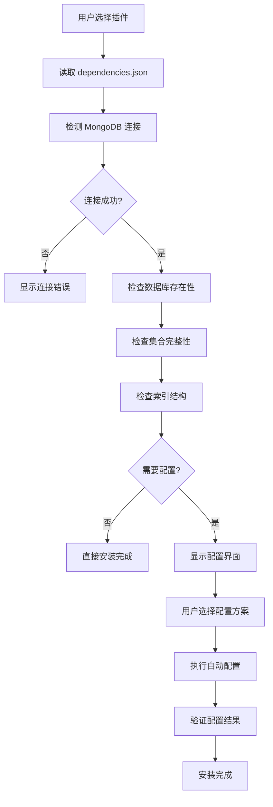

# 插件系统自动数据库配置工作流程

## 📋 目录

- [概述](#概述)
- [系统架构](#系统架构)
- [工作流程](#工作流程)
- [依赖配置格式](#依赖配置格式)
- [API接口规范](#api接口规范)
- [前端集成指南](#前端集成指南)
- [使用示例](#使用示例)
- [最佳实践](#最佳实践)
- [故障排除](#故障排除)

---

## 🎯 概述

插件系统提供了完整的自动数据库配置功能，支持 MongoDB 数据库的自动检测、创建和配置。系统能够根据插件的依赖声明，自动完成数据库、集合、索引的创建和初始化，实现插件的**零配置安装**体验。

### 🚀 核心特性

- ✅ **自动检测**：智能检测 MongoDB 连接和现有资源
- ✅ **自动创建**：根据配置自动创建数据库、集合和索引
- ✅ **灵活配置**：支持新建或使用现有数据库
- ✅ **性能优化**：自动创建必要的数据库索引
- ✅ **用户友好**：提供可视化配置界面
- ✅ **错误预防**：安装前验证所有依赖项

---

## 🏗️ 系统架构

### 核心组件

```
┌─────────────────┐    ┌─────────────────┐    ┌─────────────────┐
│   前端界面      │    │   后端API       │    │   MongoDB       │
│                 │    │                 │    │                 │
│ DependencyChecker│◄──►│PluginHandler   │◄──►│ Database        │
│                 │    │DependencyService│    │ Collections     │
│ 配置选择        │    │                 │    │ Indexes         │
└─────────────────┘    └─────────────────┘    └─────────────────┘
```

### 数据流向

```
dependencies.json → 依赖检测 → 配置选择 → 自动创建 → 验证完成
```

---

## 🔄 工作流程

### 1. 插件安装流程



### 2. 依赖检测阶段

#### 检测项目清单

- **🔌 MongoDB 连接检测**
  - 验证数据库服务是否可用
  - 检查连接字符串有效性
  - 测试读写权限

- **🗃️ 数据库存在性检查**
  - 检查目标数据库是否存在
  - 列出可用的现有数据库
  - 评估权限和空间

- **📊 集合完整性验证**
  - 检查所需集合是否存在
  - 验证集合结构和权限
  - 识别缺失的集合

- **🔍 索引结构检查**
  - 验证必要索引是否存在
  - 检查索引配置正确性
  - 识别性能优化机会

### 3. 自动配置阶段

#### 配置选项

```typescript
interface DatabaseSetupOptions {
  suggested_database_name: string      // 建议的数据库名
  create_new_database: boolean         // 创建新数据库
  use_existing_database: boolean       // 使用现有数据库
  available_databases: string[]        // 可用的现有数据库
  config: Record<string, string>       // 额外配置参数
}
```

#### 执行步骤

1. **数据库创建/选择**
2. **集合创建**
3. **索引创建**
4. **权限配置**
5. **数据初始化**（如需要）

---

## 📝 依赖配置格式

### dependencies.json 文件结构

```json
{
  "plugin_key": "plugin-name",
  "database": {
    "type": "mongodb",
    "database_name": "plugin_database",
    "required": true,
    "collections": [
      {
        "name": "collection_name",
        "description": "集合描述",
        "indexes": [
          {
            "name": "index_name",
            "fields": {
              "field_name": 1
            },
            "unique": true,
            "options": {
              "background": true
            }
          }
        ],
        "schema": {
          "_id": "ObjectId",
          "field1": "string",
          "field2": "number",
          "created_at": "date"
        }
      }
    ]
  },
  "services": [
    {
      "name": "mongodb",
      "type": "database",
      "host": "localhost",
      "port": 27017,
      "required": true,
      "description": "MongoDB数据库服务"
    }
  ],
  "environment": [
    {
      "name": "MONGODB_URI",
      "required": true,
      "type": "url",
      "description": "MongoDB连接字符串",
      "default": "mongodb://localhost:27017"
    }
  ]
}
```

### 配置字段说明

#### Database 配置
- `type`: 数据库类型（目前支持 mongodb）
- `database_name`: 数据库名称
- `required`: 是否必需
- `collections`: 集合配置数组

#### Collection 配置
- `name`: 集合名称
- `description`: 集合描述
- `indexes`: 索引配置数组
- `schema`: 数据结构定义

#### Index 配置
- `name`: 索引名称
- `fields`: 索引字段和排序方向
- `unique`: 是否唯一索引
- `options`: 额外索引选项

---

## 🔌 API接口规范

### 检查插件依赖

```http
GET /api/plugins/{pluginKey}/dependencies/check
```

**响应格式：**
```json
{
  "success": true,
  "data": {
    "plugin_key": "plugin-name",
    "overall_status": "warning",
    "can_install": true,
    "requires_setup": true,
    "database": {
      "status": "setup_required",
      "message": "数据库不存在，需要创建",
      "setup_options": {
        "suggested_database_name": "plugin_database",
        "available_databases": ["existing_db1"],
        "create_new_database": true,
        "use_existing_database": true
      }
    },
    "suggestions": [
      "需要设置数据库连接和创建必要的集合"
    ]
  }
}
```

### 配置插件数据库

```http
POST /api/plugins/{pluginKey}/dependencies/setup
Content-Type: application/json

{
  "suggested_database_name": "plugin_database",
  "create_new_database": true,
  "use_existing_database": false
}
```

**响应格式：**
```json
{
  "success": true,
  "message": "数据库设置成功"
}
```

---

## 🎨 前端集成指南

### DependencyChecker 组件使用

```vue
<template>
  <DependencyChecker
    v-model="showChecker"
    :plugin-key="selectedPlugin.key"
    @install-confirmed="handleInstallConfirmed"
  />
</template>

<script setup>
import DependencyChecker from '@/components/DependencyChecker.vue'

const showChecker = ref(false)
const selectedPlugin = ref(null)

// 显示依赖检查器
const checkDependencies = (plugin) => {
  selectedPlugin.value = plugin
  showChecker.value = true
}

// 依赖检查通过，继续安装
const handleInstallConfirmed = () => {
  // 执行插件安装逻辑
  installPlugin(selectedPlugin.value)
}
</script>
```

### 状态显示组件

```vue
<template>
  <div class="dependency-status">
    <el-tag 
      :type="getStatusType(status)" 
      size="large"
      effect="dark"
    >
      {{ getStatusText(status) }}
    </el-tag>
  </div>
</template>

<script setup>
const getStatusType = (status) => {
  switch (status) {
    case 'success':
    case 'available':
      return 'success'
    case 'warning':
    case 'setup_required':
      return 'warning'
    case 'error':
    case 'missing':
      return 'danger'
    default:
      return 'info'
  }
}
</script>
```

---

## 📚 使用示例

### 外链插件配置示例

以 `plugin-wailki` 外链插件为例：

#### 1. 依赖配置文件

```json
{
  "plugin_key": "wailki",
  "database": {
    "type": "mongodb",
    "database_name": "plugin_external_links",
    "required": true,
    "collections": [
      {
        "name": "external_links",
        "description": "外链数据表",
        "indexes": [
          {
            "name": "url_index",
            "fields": {"url": 1},
            "unique": true
          },
          {
            "name": "created_at_index",
            "fields": {"created_at": -1}
          }
        ]
      }
    ]
  }
}
```

#### 2. 自动创建结果

系统将自动创建：
- 数据库：`plugin_external_links`
- 集合：`external_links`、`link_stats`
- 索引：`url_index`（唯一）、`created_at_index`、其他性能索引

#### 3. 用户界面流程

1. 用户点击"安装插件"
2. 系统检测到需要 MongoDB 配置
3. 显示配置选择界面：
   - ✅ 创建新数据库 `plugin_external_links`
   - ⚠️ 使用现有数据库（选择列表）
4. 用户确认配置
5. 系统自动创建数据库和集合
6. 安装完成

---

## 💡 最佳实践

### 插件开发建议

#### 1. 命名规范
```json
{
  "database_name": "plugin_{plugin_key}",    // 数据库命名
  "collection_name": "{plugin_key}_{feature}", // 集合命名
  "index_name": "{field}_index"               // 索引命名
}
```

#### 2. 索引设计
```json
{
  "indexes": [
    {
      "name": "primary_query_index",
      "fields": {"status": 1, "created_at": -1},
      "description": "主要查询索引"
    },
    {
      "name": "unique_constraint_index", 
      "fields": {"unique_field": 1},
      "unique": true,
      "description": "唯一性约束"
    }
  ]
}
```

#### 3. 性能优化
- 为常用查询字段创建索引
- 使用复合索引优化多字段查询
- 避免过多不必要的索引

#### 4. 数据结构设计
```json
{
  "schema": {
    "_id": "ObjectId",
    "plugin_data": "object",
    "status": "string",
    "created_at": "date",
    "updated_at": "date",
    "version": "string"
  }
}
```

### 运维建议

#### 1. 监控指标
- 数据库连接状态
- 集合大小和文档数量
- 索引使用效率
- 查询性能

#### 2. 备份策略
- 定期备份插件数据库
- 保留配置文件备份
- 测试恢复流程

#### 3. 权限管理
- 使用最小权限原则
- 为每个插件创建专用用户
- 定期审查权限配置

---

## 🛠️ 故障排除

### 常见问题和解决方案

#### 1. MongoDB 连接失败

**问题症状：**
- 显示"无法连接到MongoDB服务器"
- 插件安装失败

**解决方案：**
```bash
# 检查 MongoDB 服务状态
systemctl status mongod

# 检查端口监听
netstat -tlnp | grep 27017

# 验证连接字符串
mongo "mongodb://localhost:27017"
```

#### 2. 权限不足

**问题症状：**
- 显示"权限不足"错误
- 无法创建数据库或集合

**解决方案：**
```javascript
// 为插件创建专用用户
use admin
db.createUser({
  user: "plugin_user",
  pwd: "secure_password",
  roles: [
    { role: "readWrite", db: "plugin_external_links" },
    { role: "dbAdmin", db: "plugin_external_links" }
  ]
})
```

#### 3. 集合创建失败

**问题症状：**
- 数据库存在但集合创建失败
- 索引创建错误

**解决方案：**
```javascript
// 手动创建集合
use plugin_external_links
db.createCollection("external_links")

// 手动创建索引
db.external_links.createIndex(
  { "url": 1 }, 
  { "unique": true, "name": "url_index" }
)
```

#### 4. 依赖配置错误

**问题症状：**
- 依赖检查失败
- 配置文件格式错误

**解决方案：**
```json
// 验证 dependencies.json 格式
{
  "plugin_key": "valid_plugin_name",
  "database": {
    "type": "mongodb",           // 必需字段
    "database_name": "db_name",  // 必需字段
    "required": true             // 必需字段
  }
}
```

### 调试工具

#### 1. 日志查看
```bash
# 查看 MongoDB 日志
tail -f /var/log/mongodb/mongod.log

# 查看应用日志
tail -f logs/plugin-system.log
```

#### 2. 手动测试
```bash
# 测试数据库连接
curl -X GET http://localhost:8080/api/plugins/test-plugin/dependencies/check

# 测试数据库创建
curl -X POST http://localhost:8080/api/plugins/test-plugin/dependencies/setup \
  -H "Content-Type: application/json" \
  -d '{"create_new_database": true, "suggested_database_name": "test_db"}'
```

#### 3. 数据库状态检查
```javascript
// MongoDB Shell 命令
show dbs                    // 显示所有数据库
use plugin_database        // 切换数据库
show collections           // 显示集合
db.collection.getIndexes() // 显示索引
```

---

## 📈 性能监控

### 关键指标

- **响应时间**：依赖检查和配置时间
- **成功率**：插件安装成功率
- **资源使用**：数据库空间和连接数
- **错误率**：配置失败和错误频率

### 监控脚本示例

```bash
#!/bin/bash
# 插件系统健康检查脚本

echo "=== 插件系统健康检查 ==="

# 检查 MongoDB 连接
mongo --eval "db.adminCommand('ping')" > /dev/null 2>&1
if [ $? -eq 0 ]; then
    echo "✅ MongoDB 连接正常"
else
    echo "❌ MongoDB 连接失败"
fi

# 检查插件数据库
plugin_dbs=$(mongo --quiet --eval "db.adminCommand('listDatabases').databases.filter(db => db.name.startsWith('plugin_')).length")
echo "📊 插件数据库数量: $plugin_dbs"

# 检查 API 服务
api_status=$(curl -s -o /dev/null -w "%{http_code}" http://localhost:8080/health)
if [ "$api_status" = "200" ]; then
    echo "✅ API 服务正常"
else
    echo "❌ API 服务异常: $api_status"
fi

echo "=== 检查完成 ==="
```

---

## 🔮 未来扩展

### 计划功能

- **🔄 自动迁移**：支持数据库结构版本升级
- **📊 性能分析**：内置数据库性能监控
- **🔒 安全增强**：数据加密和访问控制
- **🌐 多数据库支持**：支持 MySQL、PostgreSQL
- **☁️ 云服务集成**：支持云数据库服务

### 扩展接口

为未来功能预留的扩展点：

```typescript
interface PluginDatabaseProvider {
  check(config: DatabaseConfig): Promise<CheckResult>
  create(config: DatabaseConfig): Promise<CreateResult>
  migrate(from: string, to: string): Promise<MigrateResult>
  monitor(): Promise<MonitorResult>
}
```

---

**文档版本**: 1.0.0  
**最后更新**: 2025-06-20  
**维护团队**: 插件系统开发团队 