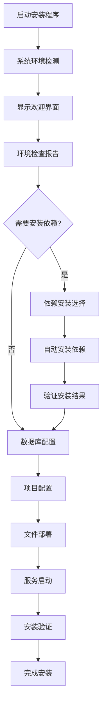

# 🚀 跨平台Web安装向导系统

## 📖 概述

这是一个基于Go + Vue.js构建的跨平台Web安装向导程序，用于自动化部署插件系统。它提供了直观的Web界面，能够自动检测系统环境、安装依赖软件、配置数据库，并完成整个项目的部署。

### ✨ 核心特性

- 🌐 **跨平台支持**: Windows、macOS、Linux
- 🎨 **友好界面**: 基于Vue.js的现代化Web界面
- 🔍 **智能检测**: 自动检测系统环境和依赖软件
- 📦 **自动安装**: 自动下载和安装缺失的依赖
- 🗄️ **数据库配置**: 支持MySQL和MongoDB配置
- ⚡ **一键部署**: 简化的安装流程

## 🏗️ 技术架构

```
┌─────────────────────────────────────────────────────────┐
│                   安装向导程序                          │
├─────────────────────────────────────────────────────────┤
│  ┌─────────────┐  ┌─────────────┐  ┌─────────────┐      │
│  │  Web界面    │  │  Go后端     │  │  系统调用   │      │
│  │             │  │             │  │             │      │
│  │ Vue.js      │◄─┤HTTP Server  │◄─┤System Utils │      │
│  │ Element Plus│  │Gin Framework│  │Package Mgr  │      │
│  │ 嵌入式资源  │  │Installation │  │File Ops     │      │
│  └─────────────┘  └─────────────┘  └─────────────┘      │
└─────────────────────────────────────────────────────────┘
```

### 技术栈

#### 后端核心
- **Go 1.21+**: 跨平台编译、高性能
- **Gin Framework**: 轻量级HTTP服务器
- **embed**: 嵌入静态资源

#### 前端界面
- **Vue 3**: 响应式用户界面
- **Element Plus**: UI组件库
- **Vite**: 前端构建工具

#### 系统集成
- **Package Managers**: 各平台包管理器集成
- **Database Drivers**: MySQL、MongoDB连接器
- **System APIs**: 文件系统、进程管理

## 🔄 安装流程



## 🚀 快速开始

### 开发环境搭建

#### 前置要求
- Go 1.21+
- Node.js 18+
- Git

#### 克隆项目
```bash
git clone <repository-url>
cd installer
```

#### 安装依赖
```bash
# Go依赖
go mod tidy

# 前端依赖
cd web
npm install
cd ..
```

#### 开发模式运行
```bash
# 启动前端开发服务器
cd web
npm run dev
# 访问 http://localhost:3001

# 启动Go后端 (另一个终端)
cd ..
go run cmd/installer/main.go
# 访问 http://localhost:8888
```

### 构建生产版本

#### 使用构建脚本 (推荐)
```bash
# 给脚本执行权限
chmod +x scripts/build.sh

# 执行构建
./scripts/build.sh
```

#### 手动构建
```bash
# 构建前端
cd web
npm run build
cd ..

# 构建各平台版本
GOOS=windows GOARCH=amd64 go build -o dist/installer-windows-amd64.exe cmd/installer/main.go
GOOS=darwin GOARCH=amd64 go build -o dist/installer-macos-amd64 cmd/installer/main.go
GOOS=linux GOARCH=amd64 go build -o dist/installer-linux-amd64 cmd/installer/main.go
```

## 📱 使用方法

### 基本使用

#### Windows
```bash
# 下载并运行
installer-windows-amd64.exe
```

#### macOS
```bash
# 赋予执行权限
chmod +x installer-macos-amd64

# 运行安装程序
./installer-macos-amd64
```

#### Linux
```bash
# 赋予执行权限
chmod +x installer-linux-amd64

# 运行安装程序
./installer-linux-amd64
```

### 命令行选项

```bash
# 基本用法
installer [选项]

# 选项说明
-port string    Web界面端口 (默认: 8888)
-silent         静默安装模式，跳过Web界面
-help          显示帮助信息

# 示例
installer                    # 启动Web安装界面
installer -port 9999         # 使用自定义端口
installer -silent            # 静默安装
```

### 安装流程说明

#### 1. 欢迎页面
- 显示系统信息
- 检查基本要求
- 开始安装流程

#### 2. 依赖检查
```
检测项目：
├── Node.js (>= 18.0)
├── npm/yarn
├── Go (>= 1.21)
├── Git
├── MySQL (>= 8.0)
└── MongoDB (>= 6.0)
```

#### 3. 自动安装
```
Windows: Chocolatey/Scoop/直接下载
macOS: Homebrew/直接下载
Linux: apt/yum/dnf/直接下载
```

#### 4. 数据库配置
- MySQL连接配置
- MongoDB配置
- 数据库创建和初始化

#### 5. 项目部署
- 文件解压和部署
- 配置文件生成
- 依赖安装和构建

#### 6. 服务启动
- 启动后端服务
- 启动前端服务
- 验证安装结果

## 🔧 平台支持

### Windows平台

#### 包管理器优先级
1. **Chocolatey** (推荐)
2. **Scoop** (备选)
3. **直接下载** (最后选择)

#### 依赖安装示例
```powershell
# 自动安装Chocolatey
Set-ExecutionPolicy Bypass -Scope Process -Force
iex ((New-Object System.Net.WebClient).DownloadString('https://chocolatey.org/install.ps1'))

# 安装依赖
choco install nodejs go git mysql mongodb -y
```

### macOS平台

#### Homebrew集成
```bash
# 自动安装Homebrew
/bin/bash -c "$(curl -fsSL https://raw.githubusercontent.com/Homebrew/install/HEAD/install.sh)"

# 安装依赖
brew install node go git mysql mongodb-community
```

### Linux平台

#### 多发行版支持
- **Debian/Ubuntu**: `apt`
- **RHEL/CentOS**: `yum`/`dnf`
- **Arch Linux**: `pacman`
- **Others**: 直接下载

#### 安装示例
```bash
# Ubuntu/Debian
sudo apt update
sudo apt install -y nodejs npm golang-go git mysql-server mongodb

# CentOS/RHEL
sudo yum install -y nodejs npm golang git mysql-server mongodb-org
```

## 📂 项目结构

```
installer/
├── cmd/
│   └── installer/
│       └── main.go              # 主程序入口
├── internal/
│   ├── detector/                # 系统检测
│   │   └── detector.go
│   ├── installer/               # 安装器
│   │   └── installer.go
│   ├── database/                # 数据库配置
│   │   └── database.go
│   ├── deployer/                # 项目部署
│   │   └── deployer.go
│   └── server/                  # HTTP服务器
│       └── server.go
├── web/                         # 前端界面
│   ├── src/
│   │   ├── App.vue
│   │   └── components/
│   ├── package.json
│   └── vite.config.ts
├── assets/                      # 静态资源
│   └── project-files.tar.gz     # 项目文件包
├── scripts/                     # 构建脚本
│   └── build.sh
├── go.mod
├── go.sum
└── README.md
```

## 🔍 系统要求

### 最低配置
- **操作系统**: Windows 10 / macOS 10.15 / Ubuntu 18.04
- **内存**: 2GB RAM
- **存储**: 5GB 可用磁盘空间
- **网络**: 需要互联网连接

### 推荐配置
- **操作系统**: Windows 11 / macOS 12+ / Ubuntu 20.04+
- **内存**: 4GB+ RAM
- **存储**: 10GB+ 可用磁盘空间
- **网络**: 稳定的宽带连接

## 🛠️ 故障排除

### 常见问题

#### 端口冲突
```bash
# 解决方案：使用其他端口
./installer -port 9999
```

#### 权限问题
```bash
# Windows: 以管理员身份运行
# macOS/Linux: 使用sudo (如需要)
sudo ./installer
```

#### 网络问题
确保能够访问以下服务：
- GitHub (下载依赖)
- NPM Registry (npm包)
- Go Module Proxy (Go模块)
- 各平台包管理器源

#### 依赖安装失败
1. 检查网络连接
2. 更新包管理器
3. 手动安装失败的依赖
4. 重新运行安装程序

### 日志和调试

#### 查看详细日志
安装程序提供实时日志输出，如遇问题请检查：
- 错误消息
- 安装步骤
- 系统检测结果

#### 手动验证
```bash
# 检查Node.js
node --version

# 检查Go
go version

# 检查MySQL
mysql --version

# 检查MongoDB
mongod --version
```

## 🤝 贡献指南

### 开发流程
1. Fork项目
2. 创建特性分支
3. 提交更改
4. 推送到分支
5. 创建Pull Request

### 代码规范
- Go: 遵循官方Go代码规范
- Vue.js: 使用ESLint和Prettier
- 提交信息: 使用约定式提交

## 📄 许可证

本项目采用 MIT 许可证 - 查看 [LICENSE](LICENSE) 文件了解详情。

## 🆘 支持

如果您遇到问题或有疑问：

1. 查看本文档的故障排除部分
2. 搜索已有的[Issues](issues)
3. 创建新的Issue描述问题
4. 联系维护团队

---

**项目状态**: 🚧 开发中  
**版本**: 1.0.0  
**最后更新**: 2024-01-20  
**维护团队**: 插件系统开发团队 